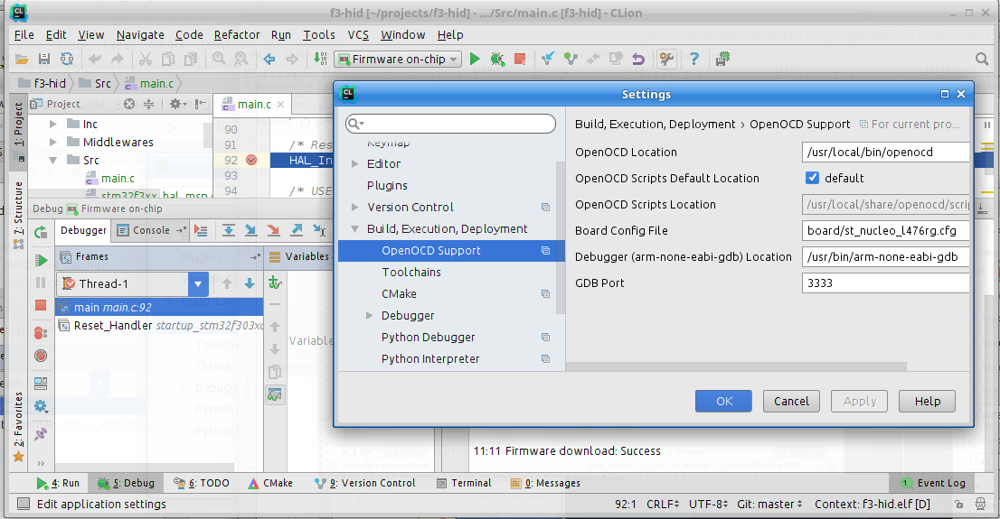

ARM MCU development plugin for JetBrains CLion 
====

Potentially you can use the plugin to work with any kind of MCU supported by GCC and OpenOCD, but major auditory for 
the plugin are STM32 developers. 

Plugin page at [Jetbrains Repository](https://plugins.jetbrains.com/plugin/10115)

Blog post at [CLion blog](https://blog.jetbrains.com/clion/2017/12/clion-for-embedded-development-part-ii)

The plugin is able to:
---
 * Convert a project made in *[STM32CubeMX](http://www.st.com/en/development-tools/stm32cubemx.html)* into a  *[CLion](https://www.jetbrains.com/clion/)* project. The project tested against CLion 2018.3 EAP.
 * Download project binaries into compatible MCU using *[OpenOCD](http://openocd.org/)*
 * Debug project on chip
 

Disclaimer
---
 * No warranties, you are using the plugin at your own risk.
 * Beware bugs! This is very early version.

License
---
[MIT](LICENSE.txt)

How To Use
---
See [USAGE.md](USAGE.md).

Contributions
===
First of all, please have a look at our [code of conduct](CODE_OF_CONDUCT.md). Well, it's standard stuff, I believe you won't do wrong things. Then read our [contribution guide](CONTRIBUTING.md). 

Likes and Donations
===

If you like the plugin, you may :star: the project at github (button at top-right of the page) and at [jetbrains plugins repository](https://plugins.jetbrains.com/plugin/10115).

The plugin is free, but you can support my work with a donation. 

[10 EUR](https://paypal.me/elmot/10eur) |
[20 EUR](https://paypal.me/elmot/20eur) |
[Other amount](https://paypal.me/elmot)

[Hall of Donators](DONATIONS.md)
--
